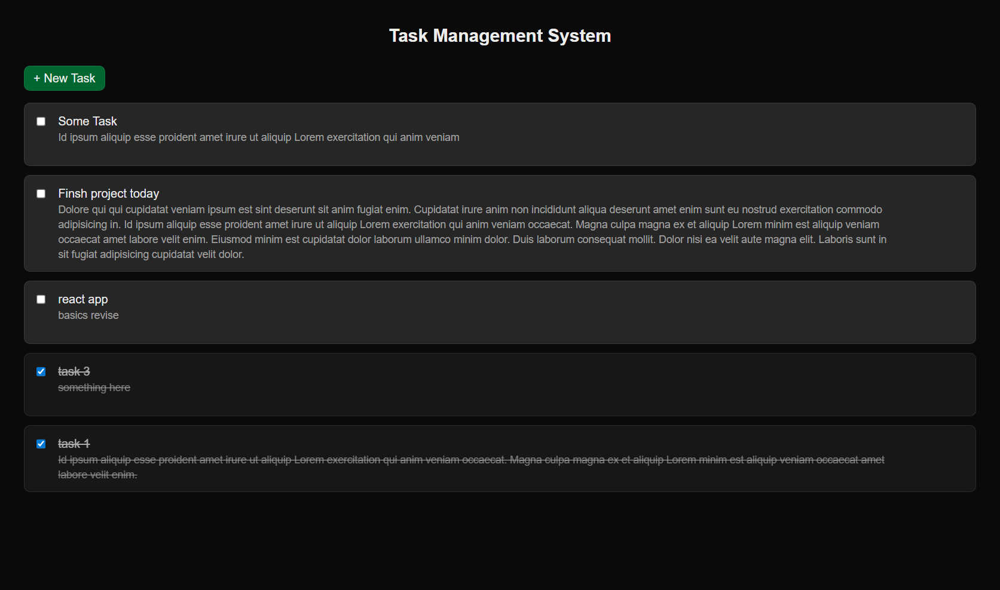

# Task Management System

Basic full stack app with all CRUD operations: Create task, read tasks, edit task, and delete task. Made with Next.js for frontend and backend, and Supabase for database.

### 🔗 Live Link: https://assignment-drop-drop-rx.vercel.app/


## 🛠️ Tech Stack

  - Next.js (React framework)
  - React.js
  - Tailwind CSS
  - Supabase
  - Vercel

## 📸 Screenshot



## 📦 Getting Started

### Prerequisites

- Node.js (>=18)
- npm or yarn or pnpm
- Supabase account and project

### Installation

1.  Clone the repository:

    ```bash
    git clone <repository-url>
    cd <repository-name>
    ```

2.  Install dependencies:

    ```bash
    npm install # or yarn install or pnpm install
    ```

3.  Set up environment variables:

    - Create a `.env.local` file in the root directory.
    - Add the following environment variables, replacing the placeholders with your actual values:

    ```
    NEXT_PUBLIC_SUPABASE_URL=your_supabase_url
    NEXT_PUBLIC_SUPABASE_PUBLISHABLE_KEY=your_supabase_publishable_key
    ```

    -   **NEXT_PUBLIC_SUPABASE_URL**: Your Supabase project URL.
    -   **NEXT_PUBLIC_SUPABASE_PUBLISHABLE_KEY**: Your Supabase publishable key.

### Running Locally

1.  Start the development server:

    ```bash
    npm run dev # or yarn dev or pnpm dev
    ```

2.  Open your browser and navigate to `http://localhost:3000`.
